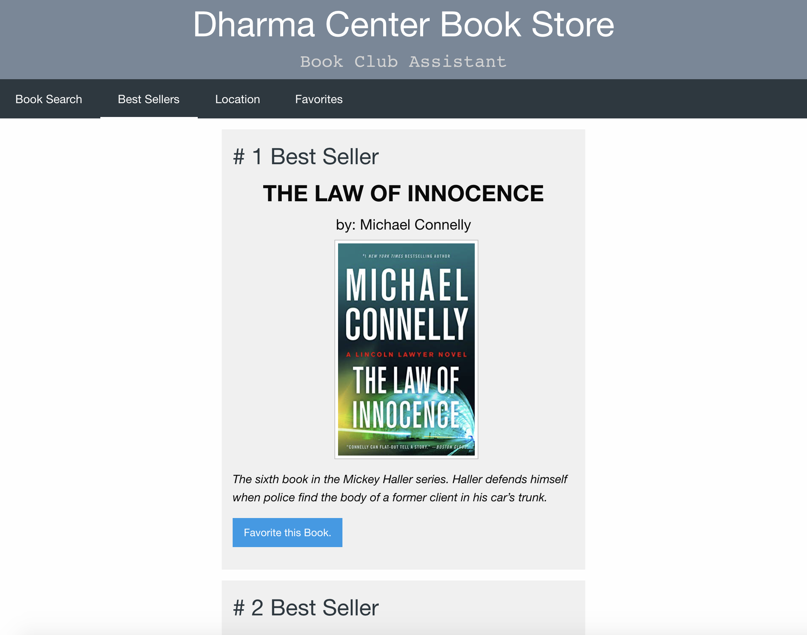
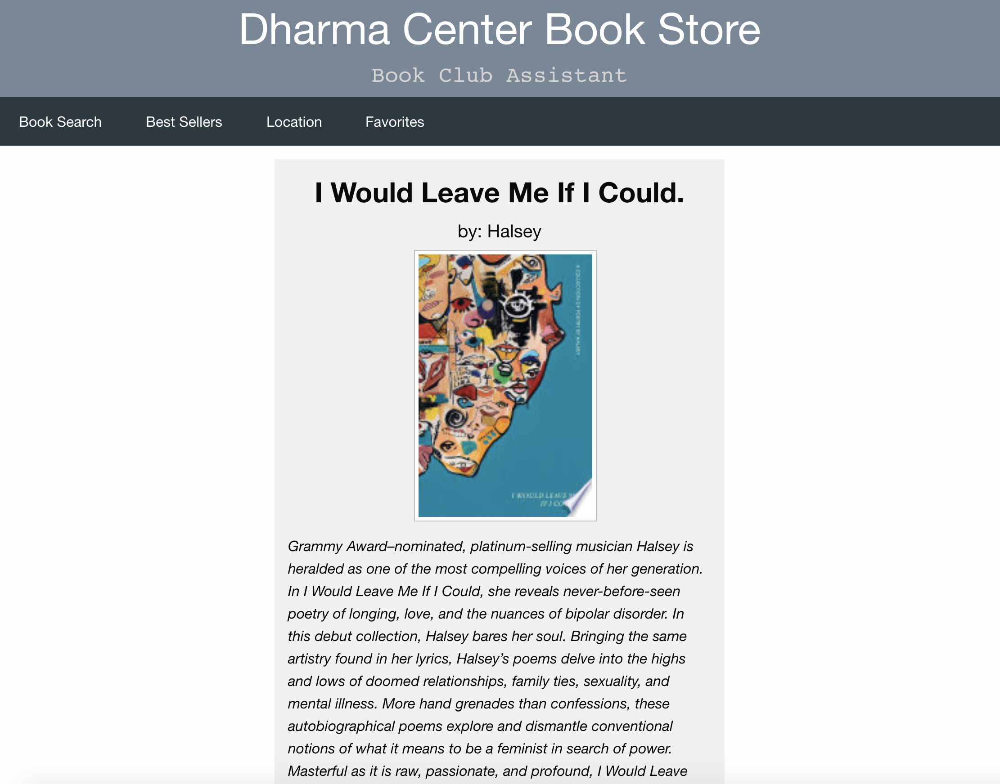

# Dharmas Bookclub
UCLA Coding Bootcamp Project 1
Dharma Center Bookstore Search and Suggestion Application

This application is designed to enhance Dharma Center Bookstore’s web presence for consumers. It utilizes the Google Books and New York Times Best Sellers list APIs to function as a sleek and simple search application. Consumers can use the search bar to find a book using the title or author. The application then dynamically creates five book suggestions based on their search parameters. Customers seeking book suggestions also have the ability to view the top five books on the New York Times Best Sellers list. The application also provides users the ability to save books to a favorites list for future reference. 

# Motivation

Dharma, like other small businesses, functions mainly on a brick and mortar basis. Larger companies and competitors, such as Barnes & Noble, dominate the virtual world. In a market where brick and mortar is dying out and being largely replaced by ecommerce, small businesses like Dharma need to improve their web presence in order to survive and thrive. 

# Features

This application features:
Foundations CSS Framework
An interactive search bar and response to user input
The use of two APIs
Google Books
New York Times Best Sellers List
The usage of client side storage for the creation of users ‘Favorites Lists’
A responsive layout
Sophisticated and simple UI

# Technologies Used

- HTML
- CSS
- Javascript
- Jquery

# API References

https://developers.google.com/books/docs/v1/reference/bookshelves
https://developer.nytimes.com/docs/books-product/1/overview

# Images

# Deployed Application Link
https://cnix273.github.io/Dharmas-bookclub/

## Contributors

Junior Developers
- Cameron Nix
- Ava Brenneke
- Jaden Lee
- Nick Johnson
- Jonathan Yee
